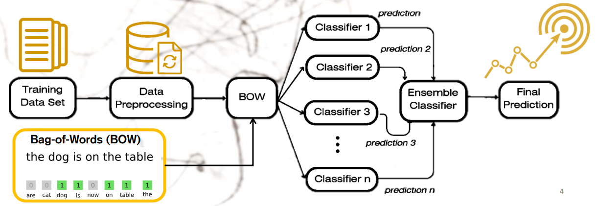
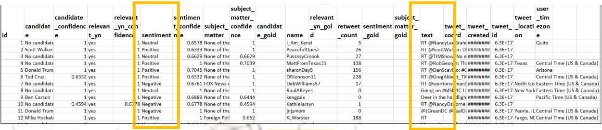
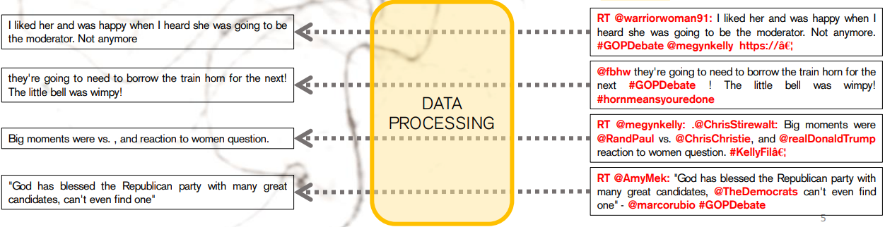
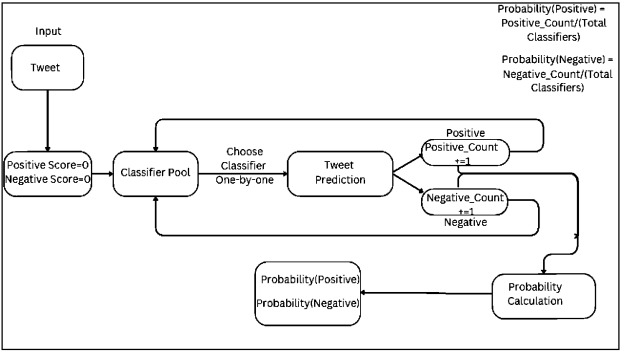
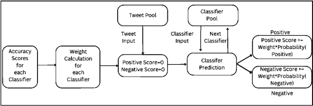
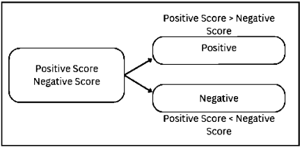
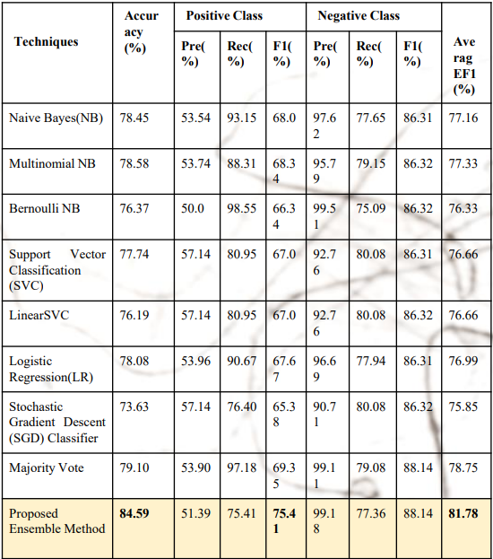
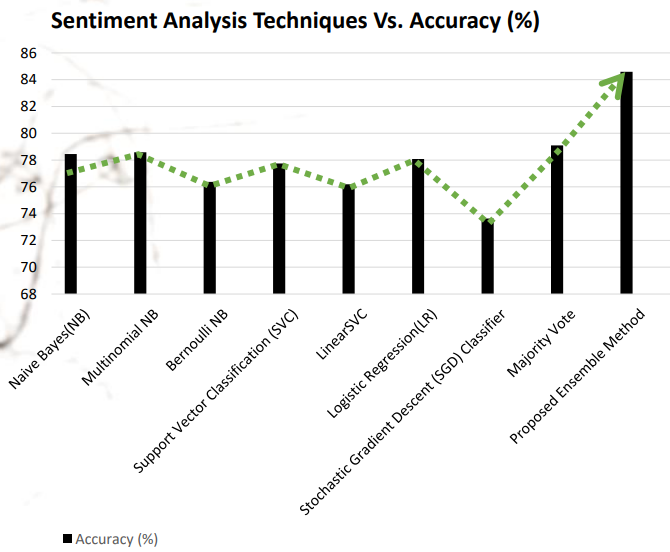

# Sentiment-Analysis
In this world of increasing mental problems among the masses, we aim to make a program that can track and notify the parents and authorities of those, particularly at risk.

### Objectives of the project

• To pre-process the available data for proper feature extraction.  
• To develop the algorithm to extract the data and classify it with base classifiers.  
• To write the Python code of the developed algorithm.  
• To analyze the results after running the Python code.  

### Steps Followed

### The Dataset
The dataset was obtained from [Kaggle](https://www.kaggle.com/datasets/crowdflower/first-gop-debate-twitter-sentiment)

We take into account the most important two columns in the dataset, that is the sentiments and the tweet. Note the that there are only two sentiment classes.

### Data Processing

#### Step 1: 
We remove all the unimportant parts of the tweets, like symbols, hastags, links all such thing

#### Step 2: Removing Stopwords and Tokenization 
We remove repetitive words like articles, conjuctions etc and tokenize the sentences

#### Step 3: Applying Classifiers

We use the following classifiers:-
1. Multinomial Naive Bayes
2. Binary Naive Bayes
3. Support Vector Classifier
4. Logistic Regression
5. Stochastic Gradient Descent Classifier

All these classifiers were imported using the scikit-learn module

#### Step 4: Ensembling Approach

##### Part-1: Sentiment Probabilty Classification

##### Part-2: Sentiment Score Calculation

##### Part-3: Sentiment Prediction

##### The Ensemble

### Results and Analysis

### Conclusion
This project was done as a part of the 6-month certificate course on AI-DS offered by CMATER Lab, JU. The project was guided by Prof. Nibaran Das and supervised by Mr. Soumyajoyti Dey

### References
1. Hetler, A. (2023) What is Twitter?, WhatIs.com. Available at:
https://www.techtarget.com/whatis/definition/Twitter (Accessed: 24 August 2023).
2. Howarth, J. (2023) Time spent using smartphones (2023 statistics), Exploding Topics. Available
at: https://explodingtopics.com/blog/smartphone-usage-stats (Accessed: 11 August 2023).
3. Veltman, C. (2022) How twitter became one of the world’s preferred platforms for sharing
ideas, KPBS Public Media. Available at:
https://www.kpbs.org/news/news/national/2022/11/22/how-twitter-became-one-of-the-worlds-pr
eferred-platforms-for-sharing-ideas (Accessed: 11 August 2023).
4. Shahane, S. (2021) Twitter sentiment dataset, Kaggle. Available at:
https://www.kaggle.com/datasets/saurabhshahane/twitter-sentiment-dataset (Accessed: 11
August 2023).
12
5. Ankit and Saleena, N. (2018) ‘An Ensemble Classification system for Twitter sentiment
analysis’, Procedia Computer Science, 132, pp. 937–946. doi:10.1016/j.procs.2018.05.109.
Alhamid, M. (2022) Ensemble models: What are they and when should you use them?, Built In.
Available at: https://builtin.com/machine-learning/ensemble-model (Accessed: 11 August
2023).
6. Hassan, A., Abbasi, A. and Zeng, D. (2013) ‘Twitter sentiment analysis: A Bootstrap Ensemble
Framework’, 2013 International Conference on Social Computing [Preprint].
doi:10.1109/socialcom.2013.56.
7. da Silva, N.F.F., Hruschka, Eduardo R. and Hruschka, Estevam R. (2014) ‘Tweet sentiment
analysis with classifier ensembles’, Decision Support Systems, 66, pp. 170–179.
doi:10.1016/j.dss.2014.07.003.
8. Chalothom, T. and Ellman, J. (2015) ‘Simple approaches of sentiment analysis via Ensemble
Learning’, Lecture Notes in Electrical Engineering, pp. 631–639.
doi:10.1007/978-3-662-46578-3_74.
9. Prusa, J.D., Khoshgoftaar, T.M. and Napolitano, A. (2015) ‘Using feature selection in
combination with ensemble learning techniques to improve tweet sentiment classification
performance’, 2015 IEEE 27th International Conference on Tools with Artificial Intelligence
(ICTAI) [Preprint]. doi:10.1109/ictai.2015.39.
10. Bird, S. (2016) Natural language processing with python. O’Reilly Media.
Kaufmann, M. (2011) Classification: Basic concepts, Data Mining (Third Edition). Available at:
https://www.sciencedirect.com/science/article/abs/pii/B9780123814791000083 (Accessed: 11
August 2023).
11. javatpoint (2020) Naive Bayes classifier in machine learning - javatpoint, www.javatpoint.com.
Available at: https://www.javatpoint.com/machine-learning-naive-bayes-classifier (Accessed: 11
August 2023).
12. GeeksforGeeks (2023) Applying multinomial naive Bayes to NLP problems, GeeksforGeeks.
Available at:
https://www.geeksforgeeks.org/applying-multinomial-naive-bayes-to-nlp-problems/ (Accessed:
11 August 2023).
13. Gill, S.S. (2020) Bernoulli Naive Bayes, Coding ninjas studio. Available at:
https://www.codingninjas.com/studio/library/bernoulli-naive-bayes (Accessed: 11 August
2023).
14. Ray, S. (2023) Learn how to use support vector machines (SVM) for Data Science, Analytics
Vidhya. Available at:
https://www.analyticsvidhya.com/blog/2017/09/understaing-support-vector-machine-example-c
ode/ (Accessed: 11 August 2023).
15. Saini, A. (2023) Guide on Support Vector Machine (SVM) algorithm, Analytics Vidhya.
Available at:
https://www.analyticsvidhya.com/blog/2021/10/support-vector-machinessvm-a-complete-guide-for-beginners/ (Accessed: 11 August 2023).
16. Bonthu, H. (2021) An introduction to logistic regression, Analytics Vidhya. Available at:
https://www.analyticsvidhya.com/blog/2021/07/an-introduction-to-logistic-regression/
(Accessed: 11 August 2023).
17. 1.5. Stochastic Gradient Descent (2023) scikit. Available at:
https://scikit-learn.org/stable/modules/sgd.html (Accessed: 11 August 2023).
18. Amsten (2023) Evaluation metrics in machine learning, GeeksforGeeks. Available at:
https://www.geeksforgeeks.org/metrics-for-machine-learning-model/ (Accessed: 23 August 2023)
