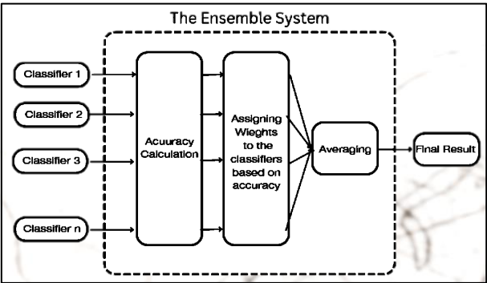

# Sentiment-Analysis
In this world of increasing mental problems among the masses, we aim to make a program that can track and notify the parents and authorities of those, particularly at risk.

### Objectives of the project

• To pre-process the available data for proper feature extraction.  
• To develop the algorithm to extract the data and classify it with base classifiers.  
• To write the Python code of the developed algorithm.  
• To analyze the results after running the Python code.  

### Steps Followed

### The Dataset
The dataset was obtained from [Kaggle](https://www.kaggle.com/datasets/crowdflower/first-gop-debate-twitter-sentiment)

We take into account the most important two columns in the dataset, that is the sentiments and the tweet. Note the that there are only two sentiment classes.

### Data Processing

#### Step 1: 
We remove all the unimportant parts of the tweets, like symbols, hastags, links all such thing

#### Step 2: Removing Stopwords and Tokenization 
We remove repetitive words like articles, conjuctions etc and tokenize the sentences

#### Step 3: Applying Classifiers

We use the following classifiers:-
1. Multinomial Naive Bayes
2. Binary Naive Bayes
3. Support Vector Classifier
4. Logistic Regression
5. Stochastic Gradient Descent Classifier

All these classifiers were imported using the scikit-learn module

#### Step 4: Ensembling Approach

##### Part-1: Sentiment Probabilty Classification

##### Part-2: Sentiment Score Calculation

##### Part-3: Sentiment Prediction

##### The Ensemble

### Results and Analysis

### Conclusion
This project was done as a part of the 6 month certificate course on AI-DS offered by CMATER Lab, JU. The project was guided by Prof. Nibaran Das and supervised by Mr. Soumyajoyti Dey

### References
1. Hassan, A., Abbasi, A. and Zeng, D. (2013) ‘Twitter sentiment
analysis: A Bootstrap Ensemble Framework’, 2013 International
Conference on Social Computing [Preprint].
doi:10.1109/socialcom.2013.56.
2. da Silva, N.F.F., Hruschka, Eduardo R. and Hruschka, Estevam R.
(2014) ‘Tweet sentiment analysis with classifier ensembles’,
Decision Support Systems, 66, pp. 170–179.
doi:10.1016/j.dss.2014.07.003.
3. Chalothom, T. and Ellman, J. (2015) ‘Simple approaches of
sentiment analysis via Ensemble Learning’, Lecture Notes in
Electrical Engineering, pp. 631–639. doi:10.1007/978-3-662-
46578-3_74.
4. Prusa, J.D., Khoshgoftaar, T.M. and Napolitano, A. (2015) ‘Using
feature selection in combination with ensemble learning techniques
to improve tweet sentiment classification performance’, 2015 IEEE
27th International Conference on Tools with Artificial Intelligence
(ICTAI) [Preprint]. doi:10.1109/ictai.2015.39.
5. Ankit and Saleena, N. (2018) ‘An Ensemble Classification system
for Twitter sentiment analysis’, Procedia Computer Science, 132,
pp. 937–946. doi:10.1016/j.procs.2018.05.109
